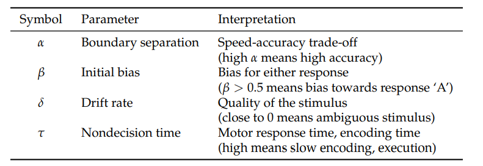
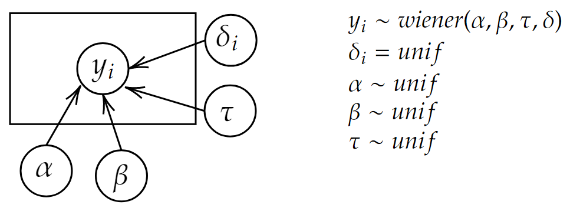
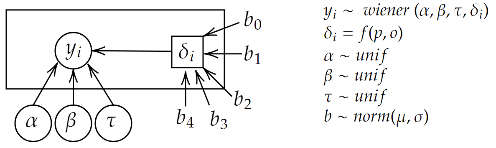
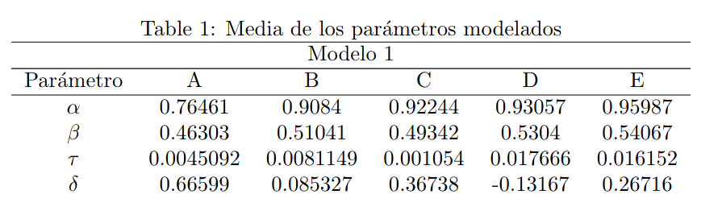
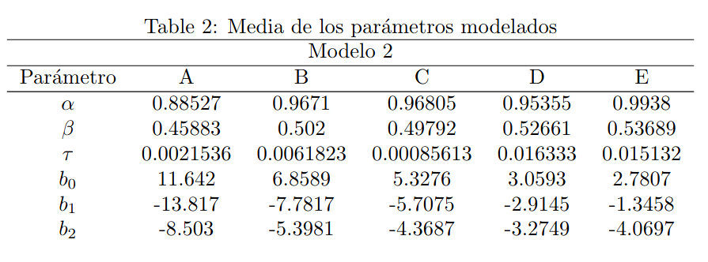
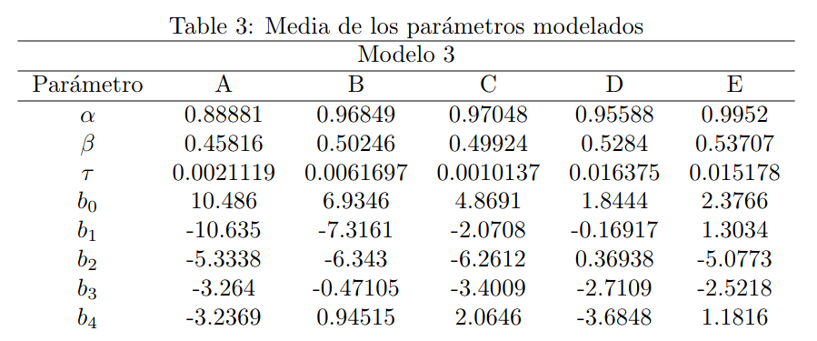
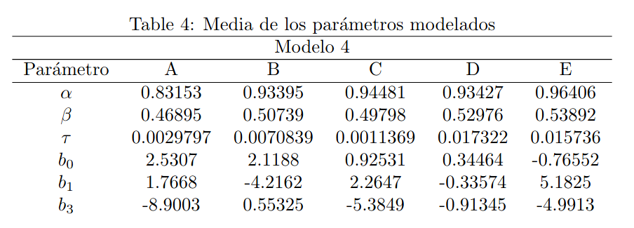
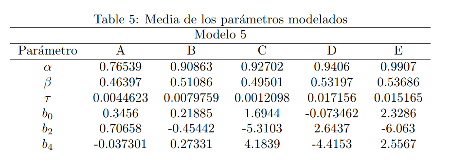
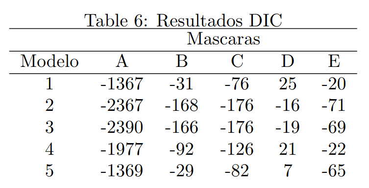
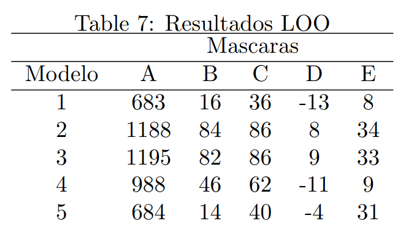

```{r setup, include=FALSE, message=FALSE, echo=FALSE, warning=FALSE}
knitr::opts_chunk$set(echo = TRUE)
```

```{r, echo=FALSE, include=FALSE, message=FALSE, echo=FALSE, warning=FALSE}
ipak <- function(pkg){
  new.pkg <- pkg[!(pkg %in% installed.packages()[, "Package"])]
  if (length(new.pkg)) 
    install.packages(new.pkg, dependencies = TRUE)
  sapply(pkg, require, character.only = TRUE)
}

# usage

packages <- c("cowplot","dplyr","ggplot2","runjags","ggpubr","knitr")
ipak(packages)

```


```{r, warning=FALSE, message=FALSE, echo=FALSE, eval=FALSE}
load("Downloads/resultsMod1.Rdata")
load("Downloads/resultsMod2.Rdata")
load("Downloads/resultsMod3.Rdata")
load("Downloads/resultsMod4.Rdata")
load("Downloads/resultsMod5.Rdata")

```


# Introducción

La reciente literatura neurocientífica ha demostrado que los procesos mentales involucrados en la toma de decisiones pueden ser modelados matemáticamente. En particular la distribución de los tiempos de decisión es concordante con una distribución de un Wiener Drift Diffusion Model. En este trabajo se proponen 5 posibles modelos de toma de decisión basados en el DDM para intentar explicar los resultados de un experimento de laboratorio donde los sujetos tuvieron que escoger entre dos alternativas. Los parámetros de los modelos se han calculado utilizando una metodología Bayesiana y se han evaluado los desempeños de esos modelos con los criterios de información de devianza (DIC) y con la validación “Leave-one-out” (LOO).


# Driff Diffution model

El _Drift Diffussion Model_ (DDM) es un modelo teórico de tiempos de respuesta para la toma de decisiones entre dos alternativas. El modelo consiste en la acumulación secuencial de evidencia a favor de una u otra alternativa hasta que se cruza un umbral hacia una de las opciones, momento en que la decisión es tomada. Entre el momento que se expone el sujeto a las alterantivas y el momento en que toma la decisión, la deriva mental entre una opción y otra es el “drift” o tasa de convergencia hacia la alternativa que es percibida como correcta. 

El modelo entrega como resultado un valor neto que corresponde al tiempo total en la toma de la decisión y un signo (positivo o negativo) que indica la alternativa elegida (en el caso de este trabajo, si se eligió la opción de la izquierda o de la derecha). 

En este trabajo se ha utilizado el modelo DDM Wiener que tiene como parámetros: el tiempo de no-decisión (tau), que corresponde al tiempo de procesamiento mental de la tarea en actividades no relacionadas a la decisión en sí misma; la separación entre las alternativas (alpha), que es la diferencia percibida entre las alternativas y da cuenta de la rapidez versus precisión en la toma de la decisión; el sesgo (beta): que corresponde a una tendencia no explicada por los parámetros del experimento que lleva a la persona a decidir más por una opción que por la otra; el “drift” (delta), que corresponde a la tasa a la que se converge hacia una de las alternativas, este parámetro da cuenta de la ambigüedad en el experimento, mientras mayor es el drift mayor es la ambigüedad en la toma de decisión y por lo tanto mayor el tiempo que se destina a elegir una de las alternativas.

# Explicación del experimento

Veinte personas participaron en un juego de ruleta, donde debían apostar a uno de los dos colores: naranjo o celeste. Cada color está asociado a una probabilidad de dar un premio, el que está indicado por el área de
ese color en la barra de una ruleta, y al monto de dicho premio potencial, indicado por el número sobre la
barra. Además, algunas ruletas (botones de la barra) tenían áreas grises que representan una máscara que
oculta el verdadero color de esas áreas. Esta condición se conoce como ambigüedad, y tuvo un rango de 0 (sin ambigüedad); 0.3; 0.4; 0.5: 0.6. Cada persona realizó el experimento en varias oportunidades obteniéndose un total de 3000 muestras.

Las variables presentes en la base de datos y que se utilizaron para los cálculos son:

- **P**: Probabilidad del color naranjo. La probabilidad del color celeste es el complemento (1-p).

- **O**: Premio normalizado del color naranjo. El premio del color celeste es el complemento (1-o)

- **a**: Rango de la máscara o grado de ambigüedad a=[0 .3 .4 .5 .6 ]

- **bias** : Lugar donde estaba la verdadera división de los colores dentro de la máscara. 0: margen
izquierdo, 0.5: mitad, 1: margen derecho.

- **pv**: Probabilidad visible izquierdo, ignorando el área de la máscara. probabilidad visible derecha 1-pv.

- **ttp**: Tiempo de aparición de las opciones, en sub milisegundos. 10000 sub milisegundos = 1 segundo.

- **ttr**: Tiempo de la respuesta.

- **F**: Resultados (1: izquierda, 2 Derecha) 

- **r**: Decisión (1: izquierda, 2 Derecha)

- **B**: Bloque o repetición del experimento en el mismo sujeto

- **sub**: Identificador de cada participante


# Metodología

El _Drift Diffussion Model_ (DDM) es un modelo teórico de tiempos de respuesta para la toma de decisiones entre dos alternativas. El modelo consiste en la acumulación secuencial de evidencia a favor de una u otra alternativa hasta que se cruza un umbral hacia una de las opciones, momento en que la decisión es tomada. Entre el momento que se expone el sujeto a las alterantivas y el momento en que toma la decisión, la deriva mental entre una opción y otra es el “drift” o tasa de convergencia hacia la alternativa que es percibida como correcta. 

El modelo entrega como resultado un valor neto que corresponde al tiempo total en la toma de la decisión y un signo (positivo o negativo) que indica la alternativa elegida (en el caso de este trabajo, si se eligió la opción de la izquierda o de la derecha). 

En este trabajo se ha utilizado el modelo DDM Wiener que tiene como parámetros: el tiempo de no-decisión (tau), que corresponde al tiempo de procesamiento mental de la tarea en actividades no relacionadas a la decisión en sí misma; la separación entre las alternativas (alpha), que es la diferencia percibida entre las alternativas y da cuenta de la rapidez versus precisión en la toma de la decisión; el sesgo (beta): que corresponde a una tendencia no explicada por los parámetros del experimento que lleva a la persona a decidir más por una opción que por la otra; el “drift” (delta), que corresponde a la tasa a la que se converge hacia una de las alternativas, este parámetro da cuenta de la ambigüedad en el experimento, mientras mayor es el drift mayor es la ambigüedad en la toma de decisión y por lo tanto mayor el tiempo que se destina a elegir una de las alternativas.

```{r, echo=FALSE, out.width="65%",fig.align='center'}



```

Para modelar la toma de decisión en este experimento se proponen 5 modelos basados en el DDM explicado anteriormente, en donde se propone que el parámetro delta (la tasa de convergencia o “drift”) puede estar relacionado con la información que tiene el sujeto sobre las alternativas que se le dan.


## Modelo 1: 

Delta es un parámetro aleatorio que proviene a priori de una distribución uniforme, al igual que los otros parámetros del modelo.


```{r, echo=FALSE, out.width="65%",fig.align='center'}



```

## Modelos 2 al 5

Delta es una función lineal de los tamaños de las barras (p), que equivale a la probabilidad de que esa barra gane en la ruleta y de los montos de los premios (o) y los demás parámetros se consideraron a priori provenientes de una distribución uniforme.


### Modelo 2

$$\delta = b_0 + b_2p + b_2o$$

### Modelo 3

$$\delta = b_0 + b_1p + b_2o + b_3p^2 + b_4p^2$$

### Modelo 4

$$\delta = b_0 + b_2o + b_3p^2$$

### Modelo 5

$$\delta = b_0 + b_2o + b_4o^2$$

\pagebreak

```{r, echo=FALSE, out.width="65%",fig.align='center'}



```

Para calcular los parámetros de los distintos modelos se utilizó la metodología Bayesiana con la función de enlace Wiener, a través del módulo JAGS Wiener [@wabersichExtendingJAGSTutorial2014] en JAGS y el paquete rjags en R-statistics. Los resultados de las distribuciones de probabilidad de los parámetros de todos los modelos, el análisis de estos parámetros y los análisis de los desempeños de los modelos se detallan en las siguientes secciones del informe.


# Resultados - Modelos y tablas sumarias


## Modelo 1 

$$ Y_{(ij)} \sim \text { Wiener }(\alpha_{(ij)}, \beta_{(ij)}, \tau_{(ij)}, \delta_{(ij)})$$

Este modelo supone una distribucion Wiener dependiente de los parámetros alfa, beta, tay y delta en función de los sujetos estudiados y los _trials_.


```{r, echo=FALSE, out.width="70%",fig.align='center',fig.cap="\\label{fig:table}Tabla de parámetros del modelo"}



```


## Modelo 2

$$Y_{(ij)} \sim \text{Wiener} (\alpha_{(ij)}, \beta_{(ij)}, \tau_{(ij)} \delta_{\left(p_{ij}, o_{ij}\right)})$$

Al igual que el modelo 1  se contemplan los mismos parámetros, con la excepción que el parámetro delta depende linealmente de la probabilidad y del premio normalizado


```{r, echo=FALSE, out.width="75%",fig.align='center'}



```

\pagebreak

## Modelo 3

$$Y_{(ij)} \sim \text{Wiener} (\alpha_{(ij)}, \beta_{(ij)}, \tau_{(ij)}, \delta_{\left(p_{ij}, o_{ij}\right)})$$


```{r, echo=FALSE, out.width="75%",fig.align='center'}



```


## Modelo 4

$$Y_{(ij)} \sim \text{Wiener} (\alpha_{(ij)}, \beta_{(ij)}, \tau_{(ij)}, \delta_{(p_{ij})})$$


```{r, echo=FALSE, out.width="75%",fig.align='center'}



```

## Modelo 5 

$$Y_{(ij)} \sim \text{Wiener} (\alpha_{(ij)}, \beta_{(ij)}, \tau_{(ij)}, \delta_{(o_{ij})})$$


```{r, echo=FALSE, out.width="75%",fig.align='center'}



```

# Resultados - Análisis de parámetros comparados por modelo

## Parámetro $\alpha$

### Modelo 1

Mayores niveles de $\alpha$  _(trade-off Speed-accuracy)_ está relacionado con un mayor nivel de accuracy que tuvieron los participantes. Si comparamos todos los $\alpha$ , como se muestran en la figura 1, desde la figura 1 “alph.1a” (sin ambigüedad) hasta la “alph1.e” (mayor nivel de ambigüedad); es posible apreciar que entre menor grado de ambigüedad, más bajo es el nivel de $\alpha$ , es decir, menor accuracy, el que iría aumentando a medida que el contraste incrementa.

Esto podría deberse a que en “alpha.1a”, la velocidad podría verse disminuida ya que los participantes pueden ver con claridad (no hay ambigüedad) la barra de la ruleta con los colores, y así, “tomarse más tiempo” para tomar una decisión; lo que no ocurriría en alpha1.e, ya que la barra tiene una máscara que oculta el verdadero color de esas áreas. 

```{r, echo=FALSE, out.width="85%",fig.align='center'}
alfa1.a <-ggdraw() + draw_image("results/plots/Modelo 1/a/Rplot01.png")
alfa1.b <-ggdraw() + draw_image("results/plots/Modelo 1/b/Rplot01.png")
alfa1.c <-ggdraw() + draw_image("results/plots/Modelo 1/c/Rplot01.png")
alfa1.d <-ggdraw() + draw_image("results/plots/Modelo 1/d/Rplot01.png")
alfa1.e <-ggdraw() + draw_image("results/plots/Modelo 1/e/Rplot01.png")


plot_grid(alfa1.a,alfa1.b,alfa1.c,alfa1.d,alfa1.e)

```

\pagebreak

### Modelo 2

Con respecto a los $\alpha$ , a nivel general, al igual que en el modelo 1, cuando no se presenta el contraste o ambigüedad, el trade-off entre el tiempo y accuracy es menor, a que cuando hay ambigüedad.


```{r, echo=FALSE, out.width="90%", fig.align='center'}
alfa2.a <-ggdraw() + draw_image("results/plots/Modelo 2/a/Rplot01.png")
alfa2.b <-ggdraw() + draw_image("results/plots/Modelo 2/b/Rplot01.png")
alfa2.c <-ggdraw() + draw_image("results/plots/Modelo 2/c/Rplot01.png")
alfa2.d <-ggdraw() + draw_image("results/plots/Modelo 2/d/Rplot01.png")
alfa2.e <-ggdraw() + draw_image("results/plots/Modelo 2/e/Rplot01.png")

plot_grid(alfa2.a,alfa2.b,alfa2.c,alfa2.d,alfa2.e)
```


### Modelo 3

En relación a los $\alpha$ , al igual que en los modelos anteriores (1 y 2), cuando no hay presencia de ambigüedad (contraste que oscurece la barra), el trade-off entre el tiempo y accuracy es menor a cuando si hay presencia de ambigüedad.


```{r, echo=FALSE, out.width="70%", fig.align='center'}

alfa3.a <-ggdraw() + draw_image("results/plots/Modelo 3/a/Rplot01.png")
alfa3.b <-ggdraw() + draw_image("results/plots/Modelo 3/b/Rplot01.png")
alfa3.c <-ggdraw() + draw_image("results/plots/Modelo 3/c/Rplot01.png")
alfa3.d <-ggdraw() + draw_image("results/plots/Modelo 3/d/Rplot01.png")
alfa3.e <-ggdraw() + draw_image("results/plots/Modelo 3/e/Rplot01.png")

plot_grid(alfa3.a,alfa3.b,alfa3.c,alfa3.d)

```

\pagebreak

### Modelo 4

En relación a los $\alpha$ del modelo 3, al igual que en los modelos anteriores (1,2 y 3), cuando no hay presencia de ambigüedad (contraste que oscurece la barra), el trade-off entre el tiempo y accuracy, es menor a cuando si hay ambigüedad.

```{r, echo=FALSE, out.width="90%", fig.align='center'}
alfa4.a <-ggdraw() + draw_image("results/plots/Modelo 4/a/Rplot01.png")
alfa4.b <-ggdraw() + draw_image("results/plots/Modelo 4/b/Rplot01.png")
alfa4.c <-ggdraw() + draw_image("results/plots/Modelo 4/c/Rplot01.png")
alfa4.d <-ggdraw() + draw_image("results/plots/Modelo 4/d/Rplot01.png")
alfa4.e <-ggdraw() + draw_image("results/plots/Modelo 4/e/Rplot01.png")

plot_grid(alfa4.a,alfa4.b,alfa4.c,alfa4.d,alfa4.e)

```

### Modelo 5

Con respecto a los $\alpha$, a nivel general, al igual que en los modelos 1,2,3 y 4, cuando no se presenta el contraste o ambigüedad, el trade-off entre el tiempo y accuracy es menor a que cuando hay ambigüedad, o el contraste es ambiguo.

```{r, echo=FALSE, out.width="90%", fig.align='center'}
alfa5.a <-ggdraw() + draw_image("results/plots/Modelo 5/a/Rplot01.png")
alfa5.b <-ggdraw() + draw_image("results/plots/Modelo 5/b/Rplot01.png")
alfa5.c <-ggdraw() + draw_image("results/plots/Modelo 5/c/Rplot01.png")
alfa5.d <-ggdraw() + draw_image("results/plots/Modelo 5/d/Rplot01.png")
alfa5.e <-ggdraw() + draw_image("results/plots/Modelo 5/e/Rplot01.png")

plot_grid(alfa5.a,alfa5.b,alfa5.c,alfa5.d,alfa5.e)

```

\pagebreak

## Parámetro $\tau$

### Modelo 1

Finalmente, con respecto a los “tau” o tiempos de no-decisión (tiempo de respuestas motoras, tiempo de codificación, entre otros), los participantes tienen mayores tiempos de no-decisión cuando hay un mayor contraste (que cuando no lo hay).

```{r,echo=FALSE, out.width="90%", fig.align='center'}
tau1.a <-ggdraw() + draw_image("results/plots/Modelo 1/a/Rplot03.png")
tau1.b <-ggdraw() + draw_image("results/plots/Modelo 1/b/Rplot03.png")
tau1.c <-ggdraw() + draw_image("results/plots/Modelo 1/c/Rplot03.png")
tau1.d <-ggdraw() + draw_image("results/plots/Modelo 1/d/Rplot03.png")
tau1.e <-ggdraw() + draw_image("results/plots/Modelo 1/e/Rplot03.png")


plot_grid(tau1.a,tau1.b,tau1.c,tau1.d,tau1.e)
```

### Modelo 2

Con respecto a los “tau” o tiempos de no-decisión, los participantes tienen mayores tiempos de no-decisión cuando hay un mayor contraste, al igual que en el tau del modelo 1.

```{r, echo=FALSE, out.width="90%", fig.align='center'}

tau2.a <-ggdraw() + draw_image("results/plots/Modelo 2/a/Rplot03.png")
tau2.b <-ggdraw() + draw_image("results/plots/Modelo 2/b/Rplot03.png")
tau2.c <-ggdraw() + draw_image("results/plots/Modelo 2/c/Rplot03.png")
tau2.d <-ggdraw() + draw_image("results/plots/Modelo 2/d/Rplot03.png")
tau2.e <-ggdraw() + draw_image("results/plots/Modelo 2/e/Rplot03.png")

plot_grid(tau2.a,tau2.b,tau2.c,tau2.d,tau2.e)
```

\pagebreak

### Modelo 3

Con respecto a los “tau” o tiempos de no-decisión, los participantes tienen mayores tiempos de no-decisión cuando hay un mayor contraste.

```{r, echo=FALSE}

tau3.a <-ggdraw() + draw_image("results/plots/Modelo 3/a/Rplot03.png")
tau3.b <-ggdraw() + draw_image("results/plots/Modelo 3/b/Rplot03.png")
tau3.c <-ggdraw() + draw_image("results/plots/Modelo 3/c/Rplot03.png")
tau3.d <-ggdraw() + draw_image("results/plots/Modelo 3/d/Rplot03.png")
tau3.e <-ggdraw() + draw_image("results/plots/Modelo 3/e/Rplot03.png")


plot_grid(tau3.a,tau3.b,tau3.c,tau3.d,tau3.e)

```


### Modelo 4

Con respecto a los “tau” o tiempos de no-decisión, los participantes tienen mayores tiempos de no-decisión cuando hay un mayor contraste, patrón que se repite en los modelos anteriores.

```{r, echo=FALSE}
tau4.a <-ggdraw() + draw_image("results/plots/Modelo 4/a/Rplot03.png")
tau4.b <-ggdraw() + draw_image("results/plots/Modelo 4/b/Rplot03.png")
tau4.c <-ggdraw() + draw_image("results/plots/Modelo 4/c/Rplot03.png")
tau4.d <-ggdraw() + draw_image("results/plots/Modelo 4/d/Rplot03.png")
tau4.e <-ggdraw() + draw_image("results/plots/Modelo 4/e/Rplot03.png")

plot_grid(tau4.a,tau4.b,tau4.c,tau4.d,tau4.e)
```


### Modelo 5

Con respecto a los “tau” o tiempos de no-decisión, los participantes tienen mayores tiempos de no-decisión cuando hay un mayor contraste.

```{r, echo=FALSE}
tau5.a <-ggdraw() + draw_image("results/plots/Modelo 5/a/Rplot02.png")
tau5.b <-ggdraw() + draw_image("results/plots/Modelo 5/b/Rplot02.png")
tau5.c <-ggdraw() + draw_image("results/plots/Modelo 5/c/Rplot02.png")
tau5.d <-ggdraw() + draw_image("results/plots/Modelo 5/d/Rplot02.png")
tau5.e <-ggdraw() + draw_image("results/plots/Modelo 5/e/Rplot02.png")

plot_grid(tau5.a,tau5.b,tau5.c,tau5.d,tau5.e)

```

\pagebreak


## Parámetro $\beta$

### Modelo 1


Respecto a los $\beta$, cuando no se presenta ambigüedad, es posible apreciar que existe cierto margen de sesgo _(bias)_ hacia presionar el botón de la ruleta izquierdo. Sin embargo, a medida que se va presentando ambigüedad, el sesgo deja de presentarse.

```{r, echo=FALSE, out.width="60%", fig.align='center'}
beta1.a <-ggdraw() + draw_image("results/plots/Modelo 1/a/Rplot02.png")
beta1.b <-ggdraw() + draw_image("results/plots/Modelo 1/b/Rplot02.png")
beta1.c <-ggdraw() + draw_image("results/plots/Modelo 1/c/Rplot02.png")
beta1.d <-ggdraw() + draw_image("results/plots/Modelo 1/d/Rplot02.png")
beta1.e <-ggdraw() + draw_image("results/plots/Modelo 1/e/Rplot02.png")

plot_grid(beta1.a,beta1.b,beta1.c,beta1.e)
```


### Modelo 2


Respecto al $\beta$ o _bias inicial_, cuando no hay ambigüedad, nuevamente (al igual que el Beta del modelo 1), existe un sesgo hacia presionar la barra izquierda, versus la derecha. Fenómeno que tendería a desaparecer a medida que el contraste de la barra y/o ambigüedad que se va presentando aumenta.


```{r, echo=FALSE, fig.align='center'}

beta2.a <-ggdraw() + draw_image("results/plots/Modelo 2/a/Rplot02.png")
beta2.b <-ggdraw() + draw_image("results/plots/Modelo 2/b/Rplot02.png")
beta2.c <-ggdraw() + draw_image("results/plots/Modelo 2/c/Rplot02.png")
beta2.d <-ggdraw() + draw_image("results/plots/Modelo 2/d/Rplot02.png")
beta2.e <-ggdraw() + draw_image("results/plots/Modelo 2/e/Rplot02.png")

plot_grid(beta2.a,beta2.b,beta2.c,beta2.d,beta2.e)

```


### Modelo 3

Respecto al $\beta$, cuando no hay ambigüedad, nuevamente, existe un sesgo hacia presionar la barra izquierda, versus la derecha. Fenómeno que tendería a desaparecer a medida que el contraste de la barra y/o ambigüedad que va teniendo el participante, aumenta.

```{r, echo=FALSE, out.width="80%", out.height="80%", fig.align='center'}
beta3.a <-ggdraw() + draw_image("results/plots/Modelo 3/a/Rplot02.png")
beta3.b <-ggdraw() + draw_image("results/plots/Modelo 3/b/Rplot02.png")
beta3.c <-ggdraw() + draw_image("results/plots/Modelo 3/c/Rplot02.png")
beta3.d <-ggdraw() + draw_image("results/plots/Modelo 3/d/Rplot02.png")
beta3.e <-ggdraw() + draw_image("results/plots/Modelo 3/e/Rplot02.png")


plot_grid(beta3.a,beta3.b,beta3.c,beta3.d,beta3.e)

```

### Modelo 4

Respecto al $\beta$ o bias inicial, cuando no hay ambigüedad, nuevamente, existe un sesgo hacia presionar la barra izquierda, versus la derecha. Fenómeno que tendería a desaparecer a medida que el contraste de la barra y/o ambigüedad que va teniendo el participante, aumenta.

```{r, echo=FALSE, fig.align='center'}
beta4.a <-ggdraw() + draw_image("results/plots/Modelo 4/a/Rplot02.png")
beta4.b <-ggdraw() + draw_image("results/plots/Modelo 4/b/Rplot02.png")
beta4.c <-ggdraw() + draw_image("results/plots/Modelo 4/c/Rplot02.png")
beta4.d <-ggdraw() + draw_image("results/plots/Modelo 4/d/Rplot02.png")
beta4.e <-ggdraw() + draw_image("results/plots/Modelo 4/e/Rplot02.png")

plot_grid(beta4.a,beta4.b,beta4.c,beta4.d,beta4.e)

```


### Modelo 5 

Respecto al $\beta$ o bias inicial, cuando no hay ambigüedad, nuevamente, existe un sesgo hacia presionar la barra izquierda, versus la derecha. Fenómeno que tendería a desaparecer a medida que el contraste de la barra y/o ambigüedad que va teniendo el participante, aumenta.


```{r, echo=FALSE}
beta5.a <-ggdraw() + draw_image("results/plots/Modelo 5/a/Rplot03.png")
beta5.b <-ggdraw() + draw_image("results/plots/Modelo 5/b/Rplot03.png")
beta5.c <-ggdraw() + draw_image("results/plots/Modelo 5/c/Rplot03.png")
beta5.d <-ggdraw() + draw_image("results/plots/Modelo 5/d/Rplot03.png")
beta5.e <-ggdraw() + draw_image("results/plots/Modelo 5/e/Rplot03.png")

plot_grid(beta5.a,beta5.b,beta5.c,beta5.d,beta5.e)

```

\pagebreak

### Parámetro $\delta$

#### Modelo 1

```{r, echo=FALSE, fig.align='center'}

delta1.a <-ggdraw() + draw_image("results/plots/Modelo 1/a/Rplot04.png")
delta1.b <-ggdraw() + draw_image("results/plots/Modelo 1/b/Rplot04.png")
delta1.c <-ggdraw() + draw_image("results/plots/Modelo 1/c/Rplot04.png")
delta1.d <-ggdraw() + draw_image("results/plots/Modelo 1/d/Rplot04.png")
delta1.e <-ggdraw() + draw_image("results/plots/Modelo 1/e/Rplot04.png")

plot_grid(delta1.a,delta1.b,delta1.c,delta1.d, delta1.e)
```

## Parámetro B0

### Modelo 2

```{r, echo=FALSE, out.width="95%", out.height="80%", fig.align='center'}

b0.2a <-ggdraw() + draw_image("results/plots/Modelo 2/a/Rplot04.png")
b0.2b <-ggdraw() + draw_image("results/plots/Modelo 2/b/Rplot04.png")
b0.2c <-ggdraw() + draw_image("results/plots/Modelo 2/c/Rplot04.png")
b0.2e <-ggdraw() + draw_image("results/plots/Modelo 2/e/Rplot04.png")
b0.2d <-ggdraw() + draw_image("results/plots/Modelo 2/d/Rplot04.png")

plot_grid(b0.2a,b0.2b,b0.2c,b0.2d,b0.2e)

```

\pagebreak


#### Modelo 3

```{r, echo=FALSE, out.width="95%", out.height="80%", fig.align='center'}
b0.3a <-ggdraw() + draw_image("results/plots/Modelo 3/a/Rplot04.png")
b0.3b <-ggdraw() + draw_image("results/plots/Modelo 3/b/Rplot04.png")
b0.3c <-ggdraw() + draw_image("results/plots/Modelo 3/c/Rplot04.png")
b0.3d <-ggdraw() + draw_image("results/plots/Modelo 3/d/Rplot04.png")
b0.3e <-ggdraw() + draw_image("results/plots/Modelo 3/e/Rplot04.png")


plot_grid(b0.3a,b0.3b,b0.3c,b0.3d,b0.3e)

```


#### Modelo 4

```{r, echo=FALSE, fig.align='center'}
b0.4a <-ggdraw() + draw_image("results/plots/Modelo 4/a/Rplot04.png")
b0.4b <-ggdraw() + draw_image("results/plots/Modelo 4/b/Rplot04.png")
b0.4c <-ggdraw() + draw_image("results/plots/Modelo 4/c/Rplot04.png")
b0.4d <-ggdraw() + draw_image("results/plots/Modelo 4/d/Rplot04.png")
b0.4e <-ggdraw() + draw_image("results/plots/Modelo 4/e/Rplot04.png")

plot_grid(b0.4a, b0.4b, b0.4c, b0.4d, b0.4e)

```

\pagebreak

### Modelo 5

```{r, echo=FALSE}
b0.5a <-ggdraw() + draw_image("results/plots/Modelo 5/a/Rplot04.png")
b0.5b <-ggdraw() + draw_image("results/plots/Modelo 5/b/Rplot04.png")
b0.5c <-ggdraw() + draw_image("results/plots/Modelo 5/c/Rplot04.png")
b0.5d <-ggdraw() + draw_image("results/plots/Modelo 5/d/Rplot04.png")
b0.5e <-ggdraw() + draw_image("results/plots/Modelo 5/e/Rplot04.png")

plot_grid(b0.5a,b0.5b,b0.5c,b0.5d,b0.5e)

```

\pagebreak

## Parámetro B1

### Modelo 2

De acuerdo a los b1, tanto en condiciones de ambigüedad como de no ambigüedad, la probabilidad que acompaña al b1 si influye en el cálculo del drift.

```{r, echo=FALSE, out.width="90%", fig.align='center'}
b1.2a <-ggdraw() + draw_image("results/plots/Modelo 2/a/Rplot05.png")
b1.2b <-ggdraw() + draw_image("results/plots/Modelo 2/b/Rplot05.png")
b1.2c <-ggdraw() + draw_image("results/plots/Modelo 2/c/Rplot05.png")
b1.2d <-ggdraw() + draw_image("results/plots/Modelo 2/d/Rplot05.png")
b1.2e <-ggdraw() + draw_image("results/plots/Modelo 2/e/Rplot05.png")

plot_grid(b1.2a,b1.2b,b1.2c,b1.2d,b1.2e)

```


### Modelo 3

De acuerdo a los b1, a diferencia del modelo 1 y 2, ahora, a medida que se va presentando un aumento de contraste (o ambigüedad), la probabilidad que acompaña al b1 deja de influir en el cálculo del drift.

```{r, echo=FALSE, out.width="90%", fig.align='center'}

b1.3a <-ggdraw() + draw_image("results/plots/Modelo 3/a/Rplot05.png")
b1.3b <-ggdraw() + draw_image("results/plots/Modelo 3/b/Rplot05.png")
b1.3c <-ggdraw() + draw_image("results/plots/Modelo 3/c/Rplot05.png")
b1.3d <-ggdraw() + draw_image("results/plots/Modelo 3/d/Rplot05.png")
b1.3e <-ggdraw() + draw_image("results/plots/Modelo 3/e/Rplot05.png")


plot_grid(b1.3a,b1.3b,b1.3c,b1.3d,b1.3e)

```

\pagebreak

### Modelo 4

De acuerdo a los b1, tanto en condiciones de ambigüedad como de no ambigüedad, la probabilidad que acompaña al b1 no influye en el cálculo del drift, sin embargo, esto cambia según el contraste que se les presente a los participantes.

```{r, echo=FALSE}
b1.4a <-ggdraw() + draw_image("results/plots/Modelo 4/a/Rplot05.png")
b1.4b <-ggdraw() + draw_image("results/plots/Modelo 4/b/Rplot05.png")
b1.4c <-ggdraw() + draw_image("results/plots/Modelo 4/c/Rplot05.png")
b1.4d <-ggdraw() + draw_image("results/plots/Modelo 4/d/Rplot05.png")
b1.4e <-ggdraw() + draw_image("results/plots/Modelo 4/e/Rplot05.png")

plot_grid(b1.4a,b1.4b,b1.4c,b1.4d,b1.4e)

```

\pagebreak

## Parámetro B2

### Modelo 2

Finalmente, respecto a b2, tanto en condiciones de ambigüedad como de no ambigüedad, el pago que acompaña al b2 si influye en el cálculo del drift.

```{r, echo=FALSE, out.width="80%", fig.align='center'}
b2.2a <-ggdraw() + draw_image("results/plots/Modelo 2/a/Rplot06.png")
b2.2b <-ggdraw() + draw_image("results/plots/Modelo 2/b/Rplot06.png")
b2.2c <-ggdraw() + draw_image("results/plots/Modelo 2/c/Rplot06.png")
b2.2d <-ggdraw() + draw_image("results/plots/Modelo 2/d/Rplot06.png")
b2.2e <-ggdraw() + draw_image("results/plots/Modelo 2/e/Rplot06.png")

plot_grid(b2.2a,b2.2b,b2.2c,b2.2d,b2.2e)
```


\

### Modelo 3

A nivel general el pago que acompaña a b2 si influye en el cálculo del drift, a excepción del b2.3d.

```{r, echo=FALSE}

b2.3a <-ggdraw() + draw_image("results/plots/Modelo 3/a/Rplot06.png")
b2.3b <-ggdraw() + draw_image("results/plots/Modelo 3/b/Rplot06.png")
b2.3c <-ggdraw() + draw_image("results/plots/Modelo 3/c/Rplot06.png")
b2.3d <-ggdraw() + draw_image("results/plots/Modelo 3/d/Rplot06.png")
b2.3e <-ggdraw() + draw_image("results/plots/Modelo 3/e/Rplot06.png")

plot_grid(b2.3a,b2.3b,b2.3c,b2.3d,b2.3e)

```

\pagebreak

### modelo 5

De acuerdo a los b2 (modelo no incluye ni b1 ni b3), a nivel general, el pago que acompaña a b2, influye y no influye en el cálculo del _drift_, dependiendo del nivel de ambigüedad (o no) que se presenta a los participantes. Por ejemplo en b2.5a, b2.5b, y b2.5d si influye, pero en b2.5c y b2.5e no influye.

```{r,echo=FALSE}
b2.5a <-ggdraw() + draw_image("results/plots/Modelo 5/a/Rplot05.png")
b2.5b <-ggdraw() + draw_image("results/plots/Modelo 5/b/Rplot05.png")
b2.5c <-ggdraw() + draw_image("results/plots/Modelo 5/c/Rplot05.png")
b2.5d <-ggdraw() + draw_image("results/plots/Modelo 5/d/Rplot05.png")
b2.5e <-ggdraw() + draw_image("results/plots/Modelo 5/e/Rplot05.png")

plot_grid(b2.5a,b2.5b,b2.5c,b2.5d,b2.5e)

```

\pagebreak

## Parámetro B3

### Modelo 3

De acuerdo a los b3, que es una función cuadrática de la probabilidad; es posible apreciar que a medida que aumenta la ambigüedad la probabilidad de los b3 no influye en el cálculo drift.

```{r, echo=FALSE, out.width="85%", fig.align='center'}

b3.3a <-ggdraw() + draw_image("results/plots/Modelo 3/a/Rplot07.png")
b3.3b <-ggdraw() + draw_image("results/plots/Modelo 3/b/Rplot07.png")
b3.3c <-ggdraw() + draw_image("results/plots/Modelo 3/c/Rplot07.png")
b3.3d <-ggdraw() + draw_image("results/plots/Modelo 3/d/Rplot07.png")
b3.3e <-ggdraw() + draw_image("results/plots/Modelo 3/e/Rplot07.png")

plot_grid(b3.3a,b3.3b,b3.3c,b3.3d,b3.3e)

```

### Modelo 4

Finalmente, de acuerdo a los b3 (el modelo no incluye b2 y b4), sólo en condiciones de ambigüedad, la probabilidad que acompaña al b3 no influye en el cálculo del drift, sin embargo, esto cambia según el contraste en el que estén los participantes.

```{r, echo=FALSE, out.width="80%", fig.align='center'}
b3.4a <-ggdraw() + draw_image("results/plots/Modelo 4/a/Rplot06.png")
b3.4b <-ggdraw() + draw_image("results/plots/Modelo 4/b/Rplot06.png")
b3.4c <-ggdraw() + draw_image("results/plots/Modelo 4/c/Rplot06.png")
b3.4d <-ggdraw() + draw_image("results/plots/Modelo 4/d/Rplot06.png")
b3.4e <-ggdraw() + draw_image("results/plots/Modelo 4/e/Rplot06.png")

plot_grid(b3.4a,b3.4b,b3.4c,b3.4d,b3.4e)

```

\pagebreak

## Parámetro B4

#### Modelo 3

Finalmente, con respecto a los b4, que es una función cuadrática del pago, es posible apreciar que a medida que aumenta la ambigüedad (al igual que el caso anterior) el pago no influye en el drift.


```{r, echo=FALSE, out.width="90%", fig.align='center'}

b4.3a <-ggdraw() + draw_image("results/plots/Modelo 3/a/Rplot08.png")
b4.3b <-ggdraw() + draw_image("results/plots/Modelo 3/b/Rplot08.png")
b4.3c <-ggdraw() + draw_image("results/plots/Modelo 3/c/Rplot08.png")
b4.3d <-ggdraw() + draw_image("results/plots/Modelo 3/d/Rplot08.png")
b4.3e <-ggdraw() + draw_image("results/plots/Modelo 3/e/Rplot08.png")

plot_grid(b4.3a,b4.3b,b4.3c,b4.3d,b4.3e)

```

### Modelo 5

Finalmente, con respecto a los b4, de manera similar al b2, hay casos en que el pago influye en el drift, y casos en que no, independientemente del nivel de ambigüedad.

```{r, echo=FALSE, out.width="90%", fig.align='center'}
b4.5a <-ggdraw() + draw_image("results/plots/Modelo 5/a/Rplot06.png")
b4.5b <-ggdraw() + draw_image("results/plots/Modelo 5/b/Rplot06.png")
b4.5c <-ggdraw() + draw_image("results/plots/Modelo 5/c/Rplot06.png")
b4.5d <-ggdraw() + draw_image("results/plots/Modelo 5/d/Rplot06.png")
b4.5e <-ggdraw() + draw_image("results/plots/Modelo 5/e/Rplot06.png")

plot_grid(b4.5a,b4.5b,b4.5c,b4.5d,b4.5e)

```

\pagebreak

# Ajuste de modelo DIC y LOO

Como queda en evidencia en la tabla 6, el DIC indica que en el experimento sin máscara (A), el modelo que mas se ajusta a los datos es aquel que incorpora la probabilidad y el premio en una relación cuadrática. Este hallazgo se repite para todos los niveles de ambigüedad, exceptuando la máscara al 0.6 (E) y  y al 0.3 (B). No obstante, esta diferencia es marginal.  


```{r, echo=FALSE, out.width="42%", fig.align='center'}



```


Los hallazgos resultantes del DIC son concordantes al revisar el Leave-One-Out (LOO), dado que el modelo 3 sigue siendo el de mejor ajuste en función a la muestra trabajada, con una diferencia marginal con el modelo 2 (el cual muestra un ajuste ligeramente mejor en las máscaras al 0.3 y 0.6).


```{r, echo=FALSE, out.width="42%", fig.align='center'}



```

Los hallazgos resultantes del DIC son concordantes al revisar el Leave-One-Out (LOO), dado que el modelo 3 sigue siendo el de mejor ajuste en función a la muestra trabajada, con una diferencia marginal con el modelo 2 (el cual muestra un ajuste ligeramente mejor en las máscaras al 0.3 y 0.6).

Finalmente, como próximos desafíos, sería interesante ahondar en otras funciones para la relación de la probabilidad y el premio con el Drift.


# Referencias


